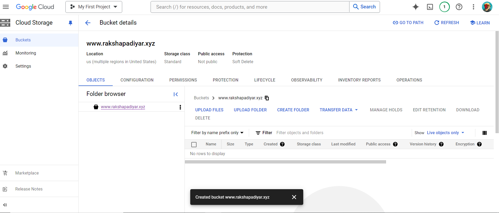
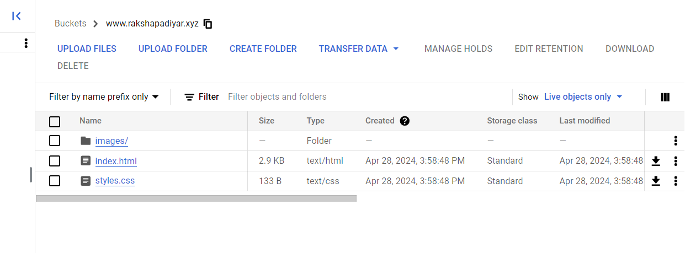

# Static-Serve
## Overview
* This is a Cloud Project for hosting a static website on Google Cloud Infrastructure using Google Cloud Storage Service.   
* Static websites are preferred by users with a smaller scope on website traffic and interactions. For instance, by NGO's, small businesses, personal blogs, landing pages, event websites etc.   
* These websites consist of simple pages made of HTML, CSS and JavaScript. They do not contain any server side scripts like PHP, Node.js.

## Setup Instructions
* A Google Cloud Account (free tier/ with billing account setup).
* A domain (rakshapadiyar.xyz domain from Godaddy domain registrar for this project).

## Deployment Process
* Step 1: Built a simple website with HTML and used Bootstrap for styling. Added images of various travel destinations in the website.   
* Step 2: Created a storage bucket named "www.rakshapadiyar.xyz" (without the double quotes).   
   
* Step 3: Uploaded all the website files into the bucket directly from Google Cloud console.   
   
* Step 4: 
## Configuration Details
## Troubleshooting
## Resources