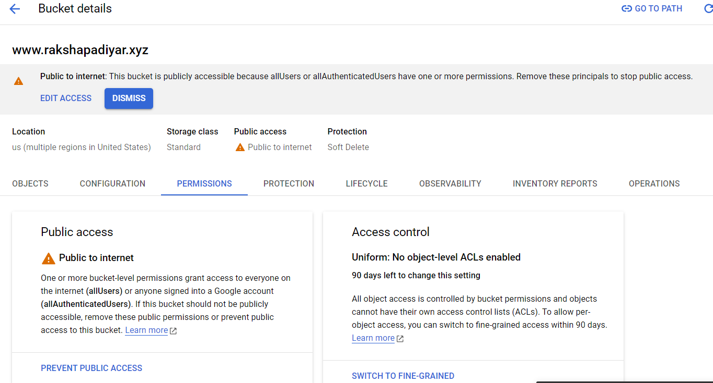
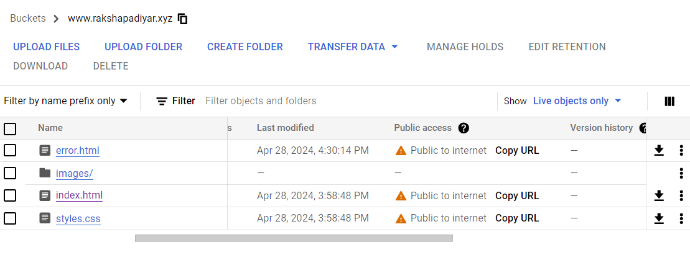

# Static-Serve

## Overview

- This is a Cloud Project for hosting a static website on Google Cloud Infrastructure using Google Cloud Storage Service.
- Static websites are preferred by users with a smaller scope on website traffic and interactions. For instance, by NGO's, small businesses, personal blogs, landing pages, event websites etc.
- These websites consist of simple pages made of HTML, CSS and JavaScript. They do not contain any server side scripts like PHP, Node.js.

## Setup Instructions

- A Google Cloud Account (free tier/ with billing account setup).
- A domain (rakshapadiyar.xyz domain from Godaddy domain registrar for this project).

## Deployment Process

- **Step 1**: Built a simple website with HTML and used Bootstrap for styling. Added images of various travel destinations in the website.

- **Step 2**: Created a storage bucket named "www.rakshapadiyar.xyz" (without the double quotes). Creating a bucket with a domain name required a simple ownership verification by google.  
  

- **Step 3**: Uploaded all the website files into the bucket directly from Google Cloud console.  
  

- **Step 4**: Made all the data in the bucket as public so that the website content can be publicly accessed.  
   -> Clicked on Bucket -> Permissions ->Grant Access -> allUsers as the Principal -> Storage Object Viewer as Role.

            -> Click on Allow Public Access.

            -> The bucket is now public.

- **Step 5**: Created a error.html page and uploaded it to the bucket. The uploaded file is by default public to internet as the entire bucket was made publicly accessible earlier.
  

- **Step 6**: Assigned specialty pages. Clicked on the bucket overflow menu option of the public bucket -> edit website configuration. Set index.html as the entry point and error.html as the custom error page.
  

- **Step 7**: Added DNS record in the website registrar.
  -> Signed-in into website registrar -> Selected the domain rakshapadiyar.xyz -> DNS Management ->added a dns record with the following values

              type : CNAME
              name : www
              data : c.storage.googleapis.com.
              ttl  : 600 seconds

             This connects the domain to the cloud storage.

## Troubleshooting

- Tested if the website is rendered correctly from the cloud storage public url (https://storage.googleapis.com/www.rakshapadiyar.xyz/index.html).
  

- Used DNSchecker.com to verify if the DNS record update has propogated so that the bucket content is rendered when a user browses the domain rakshapadiyar.xyz.
  

## Conclusion

- The website was successfully hosted and was accessible over the domain rakshapadiyar.xyz after the assigned TTL seconds.
  

- Website accessed from my mobile phone.
  
